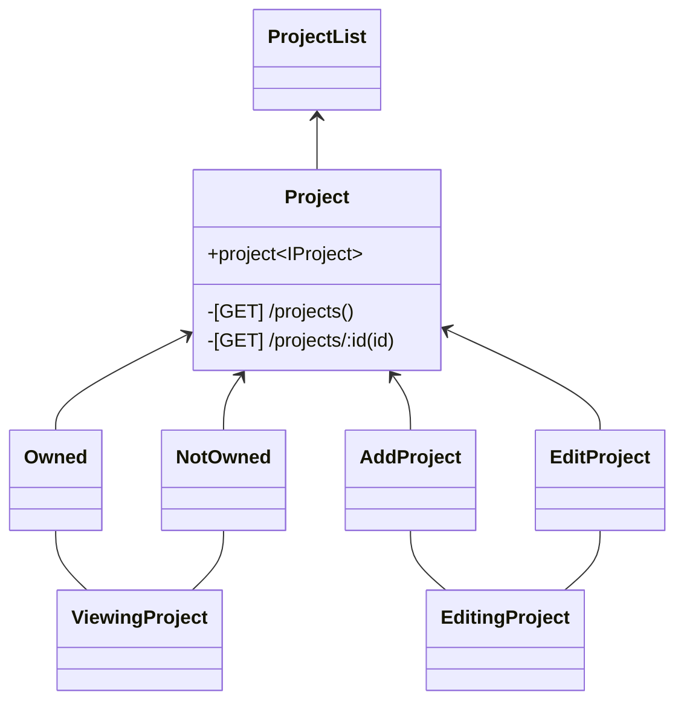

```mermaid
classDiagram

    
    Project List <--  Project
    Project <--  Owned
    Project <--  NotOwned
    Project <--  AddProject
    Project <--  EditProject

    Owned -- ViewingProject
    NotOwned -- ViewingProject
    AddProject -- EditingProject
    EditProject -- EditingProject

    class Project List{
    
    }

    class Project{
    +project~IProject~
    -[GET] /projects ()
    -[GET] /projects/:id (id)
    }

    class Owned{
    }
```